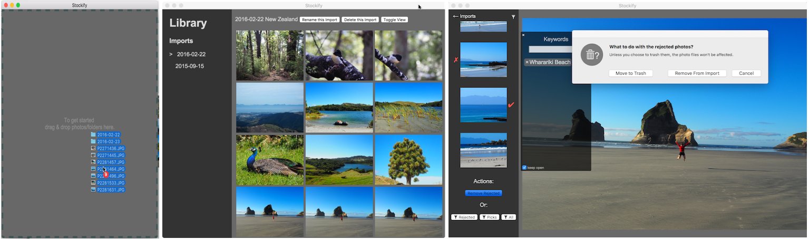

# Stockify
An [Electron](https://github.com/electron/electron) + [Angular](https://angularjs.org/) based desktop application for viewing and sorting photos. Designed to feel fast and simple to use.  



## Downloads

[OSX x64](https://s3-ap-southeast-2.amazonaws.com/iem9b5snbg8n-static-host/Stockify-OSX-x64.zip)  
[Windows x64](https://s3-ap-southeast-2.amazonaws.com/iem9b5snbg8n-static-host/Stockify-win32-x64.zip)  
Other platforms available on request, or run/build from source yourself (see below).

## User Docs & Purpose

Version one has one key purpose: to allow you to easily tag-to-remove photo's you don't like from a collection of photos while viewing them. You may also tag favorites (right keyboard arrow) and add keywords (start typing in the import view) but there's is no further functionality associated with these actions yet.

### Importing
Simply drag-drop photo files and/or folders containing photo files onto the application at any time. The import will be dated according to the earliest photo taken, making a 'photo trail' from successive imports. Only JPEG files are supported presently. Note: Thumbnails will be generated for each photo in the background; for large imports this may take some time (~1000 photos/minute) and Stockify might be faster when done.

### Viewing
After an import you will be taken directly to the 'import view'. There, use the up and down arrow keys, or scroll and click photos to view them. Use the left and right arrow keys to mark a photo as a 'reject' (a cross) or a 'pick' (a tick). You may remove all rejects from the import at any time by selecting `CMD-Del`/`Ctrl-Del`, or by scrolling to the end of the import and clicking the associated button.

### Library View
By default the library view scales and crops your images so they can be viewed as a full preview grid. If you toggle the view, it will ensure the full photo is seen in the preview, but you lose the grid if there are numerous portrait photos or those with differing dimensions. 

### About photo file management
Your photo files are untouched by Stockify unless you use Stockify to trash them. Note that if you move the files from the location from which they were imported they appear as missing. The workaround is to delete the associated import, and re-import them from the new location.


## Run from source

[Download](https://github.com/danielrob/Stockify/archive/master.zip) or clone the repository then:

```
npm install  
electron .
```  

## Build from source

You can use [electron-packager](https://github.com/electron-userland/electron-packager). Example:  


`electron-packager . --platform=darwin --arch=x64 --icon Stockify/app/icons/Stockify.icns`  
or  
`electron-packager . --all --icon app/icons/Stockify.icns`  


## Contributing

Anyone can feel free to add a feature request or raise bugs in the [issue tracker](https://github.com/danielrob/Stockify/issues). UX and/or designer suggestions welcome!

You may also: 

1. Fork it!
2. Create your feature branch: `git checkout -b my-new-feature`
3. Commit your changes: `git commit -am 'Add some feature'`
4. Push to the branch: `git push origin my-new-feature`
5. Submit a pull request :D

## License

[BSD 2-clause.](LICENSE.txt)
